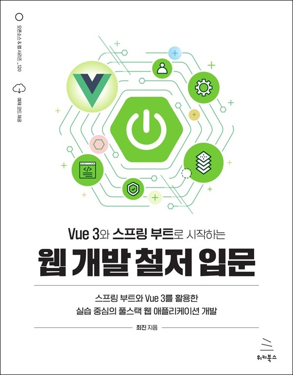

# Vue 3와 스프링 부트로 시작하는 웹 개발 철저 입문
### 스프링 부트와 Vue 3를 활용한 실습 중심의 풀스택 웹 애플리케이션 개발

- **최진** 지음
- ISBN: 9791158395599
- 판형: 188\*240\*27mm
- 38,000원 | 2025년 1월 21일 발행 | 672쪽
- [책 홈페이지](https://wikibook.co.kr/vue3-springboot/)
- [도서 미리보기](http://www.yes24.com/Product/Viewer/Preview/141256205)
- [도서 관련 문의](https://wikibook.co.kr/support/contact/)

---

**Vue 3와 스프링 부트의 풍부하고 다양한 도구들을 활용해 최신 풀스택 애플리케이션 개발 비법을 배워보자!**

《Vue 3와 스프링 부트로 시작하는 웹 개발 철저 입문》은 일상의 언어로 만든 학습서입니다. 복잡한 용어나 어려운 도식을 배제하고, 친숙한 언어와 직관적인 그림으로 누구나 쉽게 이해할 수 있도록 구성했습니다. 추상적인 개념은 비유와 밈을 활용해 풀어내고, 구체적인 실습은 애플리케이션 개발의 전체적인 흐름을 이해할 수 있도록 단계별로 진행합니다.

이 책에서는 개발자가 알아야 할 기초 지식, 다양한 라이브러리, 프레임워크, 클라우드 컴퓨팅 서비스 등을 폭넓게 경험할 수 있습니다. 특히 Vue와 스프링 부트를 핵심 주제로 삼아 깊이 있게 다루되, 실무에서 잘 사용되지 않는 기능은 과감히 제외해서 실용성을 높였습니다. 이 책을 읽고 나면 기초가 탄탄하고 다양한 기술을 활용할 수 있는 풀스택 개발자가 될 수 있을 것입니다.

**★ 이 책에서 다루는 내용 ★**

- 프런트엔드와 백엔드의 기초 지식
- 다양한 오픈소스 라이브러리 및 프레임워크 활용법
- Vue 3 기초 지식
- Vue 3를 활용한 메모 애플리케이션 개발
- Vue 3와 스프링 부트를 활용한 쇼핑몰 애플리케이션 개발 및 배포
- 스프링 부트의 기초 지식
- 스프링 부트를 활용한 HTTP API 개발
- 데이터베이스와 스프링 데이터 JPA의 기초 지식
- AWS의 EC2 생성 및 운영 환경 구축
- 다양한 개발 도구의 활용법

---
 
 ## 구입처
 
 - [예스24](https://www.yes24.com/Product/Goods/141256205)
 - [교보문고](https://product.kyobobook.co.kr/detail/S000215152090)
 - [알라딘](https://www.aladin.co.kr/shop/wproduct.aspx?ItemId=355470631)
 - [쿠팡](https://www.coupang.com/vp/products/8542898276?itemId=24735200669)